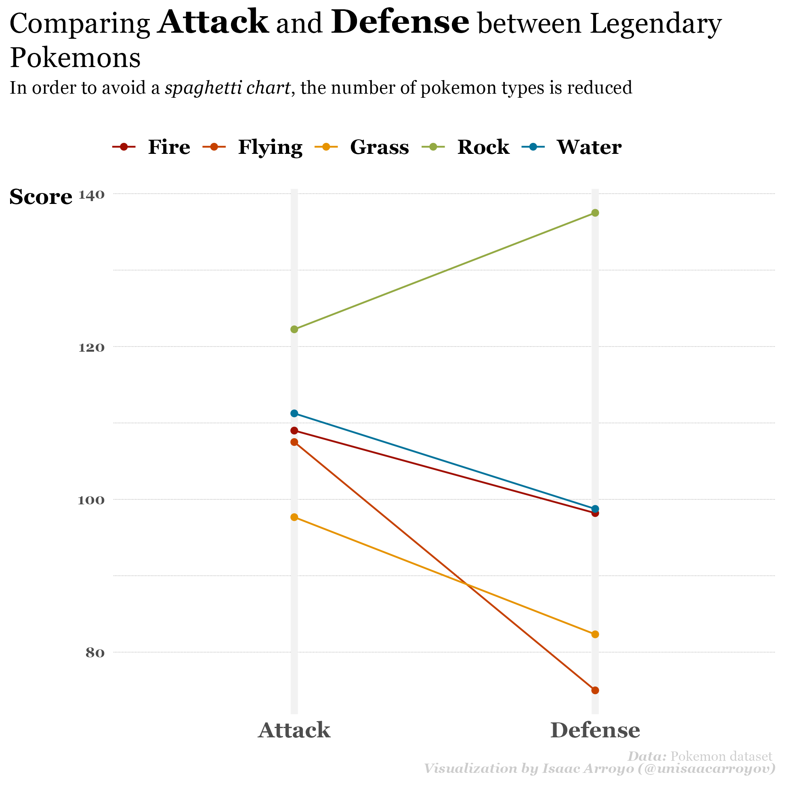

# Comparison :a: vs :b:
## Day 1: part-to-whole
**Tool:** Adobe Illustrator

## Day 2: pictogram
**Tool:** Python + Altair  
[**Code**](https://github.com/isaacarroyov/30DayChartChallenge/blob/main/day_02/30daychartchallenge_day2_pictogram.ipynb)

## Day 3: historical
**Tool:** Python + Matplotlib + Adobe Illustrator  
[**Code**](https://github.com/isaacarroyov/30DayChartChallenge/blob/main/day_03/30daychartchallenge_day_02_historical.ipynb)

## Day 4: flora
**Tool:** Adobe Illustrator

## Day 5: slope
**Tool:** R  
[**Code**](https://github.com/isaacarroyov/30DayChartChallenge/blob/main/day_05/30daychartchallenge_day_05_slope.R)

## Day 6: Data day :arrow_right: Our World In Data (OWID)
**Tool:** R  
[**Code**](https://github.com/isaacarroyov/30DayChartChallenge/blob/main/day_06/30daychartchallenge_day_06_owid.R)

# Distribution :wavy_dash:

## Day 7: physical
**Tool:** Python + Matplotlib + Seaborn  
[**Code**](https://github.com/isaacarroyov/30DayChartChallenge/blob/main/day_07/30daychartchallenge_day_07_physical.png)

## Day 8: mountains
**Tool:** Python + Google Earth Engine API  
**Extra:** To create the final layout I used Illustrator.

[**Code**](https://github.com/isaacarroyov/30DayChartChallenge/blob/main/day_08/30daychartchallenge_day_07_physical.ipynb)

## Day 9: statistics
**Tool:** R  
[**Code**](https://github.com/isaacarroyov/30DayChartChallenge/blob/main/day_09/30daychartchallenge_day_09_statistics.R)

## Day 11: circular
**Tool:** R  
[**Code**](https://github.com/isaacarroyov/30DayChartChallenge/blob/main/day_11/30daychartchallenge_day_11_circular.R)

## Day 12: The economist
**Tools:** R (Base plot) + Illustrator (Retouches)  
[**Code**](https://github.com/isaacarroyov/30DayChartChallenge/blob/main/day_12/30daychartchallenge_day_12_the_economist.R)

# Relationships :a::left_right_arrow::b:
## Day 13: correlation
**Tool:** R  
[**Code**](https://github.com/isaacarroyov/30DayChartChallenge/blob/main/day_13/30daychartchallenge_day_13_correlation.R)

## Day 14: 3-dimensional
**Tool:** Python + plotly  
[**Code**](https://github.com/isaacarroyov/30DayChartChallenge/blob/main/day_14/30daychartchallenge_day_14_3-dimensional.py)  

## Day 15: multivariate
**Tool:** R + Adobe Illustrator  
[**Base chart**](https://github.com/isaacarroyov/30DayChartChallenge/blob/main/day_15/30daychartchallenge_day_15_multivariate.R)

## Day 16: environment
**Tool** Datawrapper
[**Data processing**](https://github.com/isaacarroyov/30DayChartChallenge/blob/main/day_16/30daychartchallenge_day_16_environment.R)
and [**Data**](https://raw.githubusercontent.com/isaacarroyov/30DayChartChallenge/main/data/top15_countries_endemic_species_animals.csv)

[**Interactive chart**](https://www.datawrapper.de/_/PLdu1/)

## Day 17: connections
**Tool**: JavaScript + `canvas-sketch`  
[**Code**](https://github.com/isaacarroyov/30DayChartChallenge/blob/main/day_17/30daychartchallenge_day_17_connections.js)

## Day 18: OECD
**Tool:** R  
[**Code**](https://github.com/isaacarroyov/30DayChartChallenge/blob/main/day_18/30daychartchallenge_day_18_OECD.R)

# Time series :hourglass_flowing_sand:
## Day 19: global change
**Tool**: R  
[**Code**](https://github.com/isaacarroyov/30DayChartChallenge/blob/main/day_19/30daychartchallenge_day_19_global_change.R)

## Day 20: new tool
**Tool**: Procreate

## Day 21: down/upwards
**Tool**: Datawrapper  
[**Interactive chart (Datawrapper)**](https://www.datawrapper.de/_/WwVR1/)  
[**Data processing with R**](https://github.com/isaacarroyov/30DayChartChallenge/blob/main/day_21/30daychartchallenge_day_21_down-upwards.R)

## Day 22: animation
**Tool**: R  
[**Code**](https://github.com/isaacarroyov/30DayChartChallenge/blob/main/day_22/30daychartchallenge_day_22_animation.R)

## Day 23: tiles
**Tool**: Flourish  
**Interactive charts [English version](https://public.flourish.studio/visualisation/9890981/) and [version en Español](https://public.flourish.studio/visualisation/9890129/)**  

[**Data processing with Python and Google Earth Engine**](https://github.com/isaacarroyov/30DayChartChallenge/blob/main/day_23/30daychartchallenge_day_23_tiles.py)

## Day 24: Financial Times
**Tool**: R  
[**Code**](https://github.com/isaacarroyov/30DayChartChallenge/blob/main/day_24/30daychartchallenge_day_24_financial-times.R)

