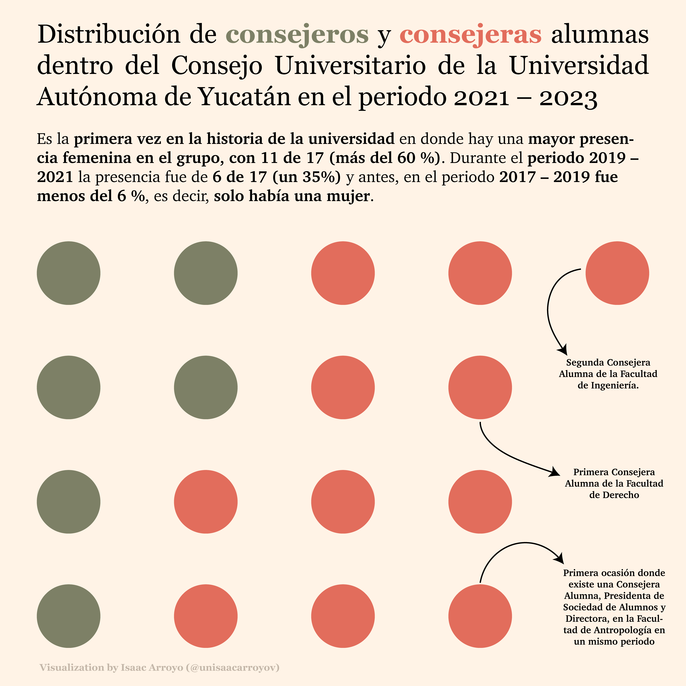
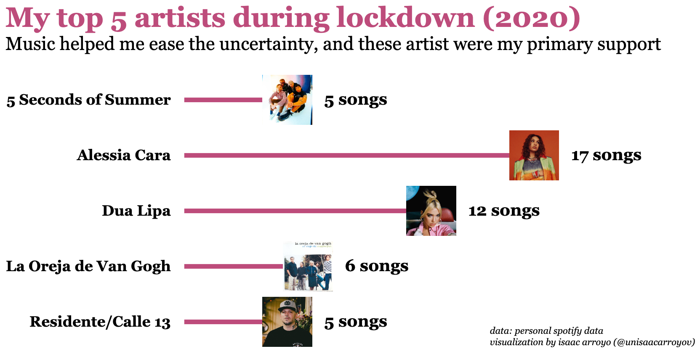
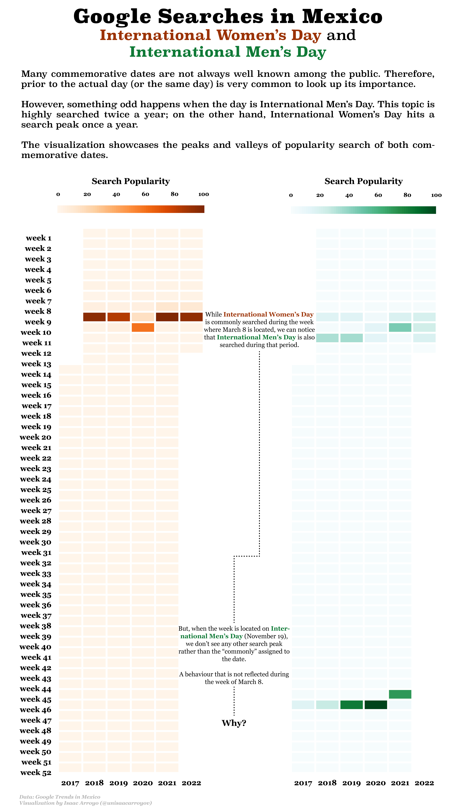
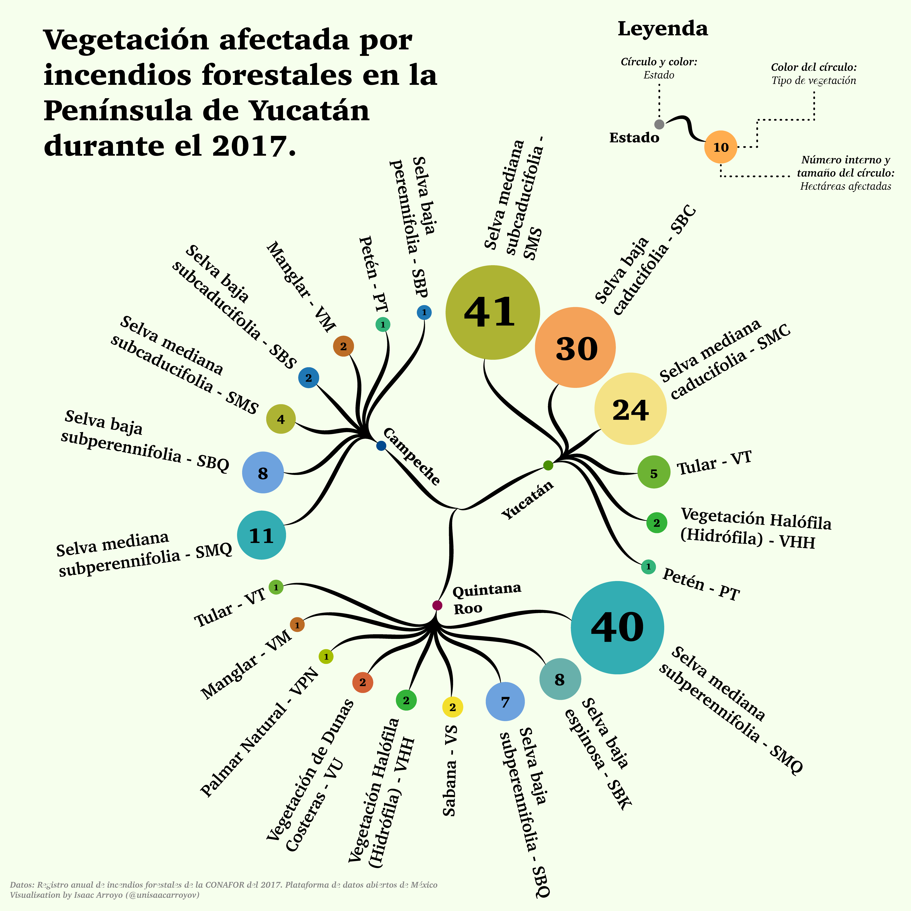
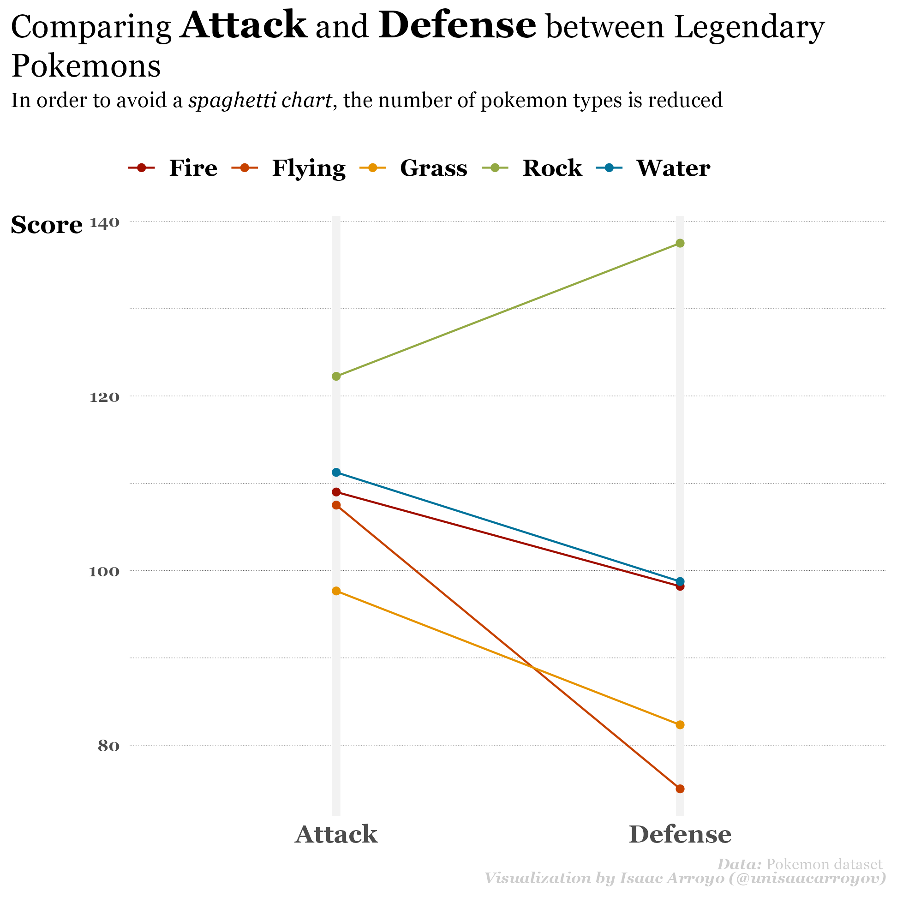

# The #30DayChartChallenge
This repository contains all the charts made for the **#30DayChartChallenge** during the month of April.

This project aims to explore creativity and tools conserning #DataVisualization.

## 2022 Gallery
### Day 1: part-to-whole
**Tool:** Adobe Illustrator

### Day 2: pictogram
**Tool:** Python + Altair  
[**Code**](https://github.com/isaacarroyov/30DayChartChallenge/blob/main/2022/day_02/30daychartchallenge_day2_pictogram.ipynb)

### Day 3: historical

**Tool:** Python + Matplotlib + Adobe Illustrator  
[**Code**](https://github.com/isaacarroyov/30DayChartChallenge/blob/main/2022/day_03/30daychartchallenge_day_02_historical.ipynb)

### Day 4: flora
**Tool:** Adobe Illustrator

### Day 5: slope

**Tool:** R

