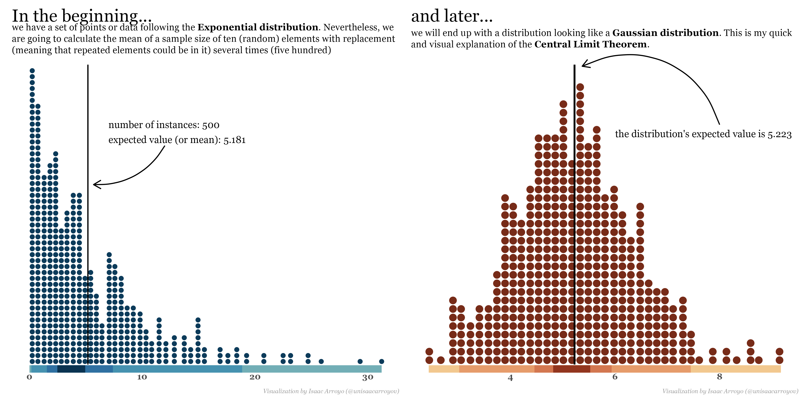

# The #30DayChartChallenge
This repository contains all the charts made for the **#30DayChartChallenge** during the month of April.

This project aims to explore creativity and tools conserning #DataVisualization.

# 2022 Gallery
## Comparison :a: vs :b:
### Day 1: part-to-whole
**Tool:** Adobe Illustrator

### Day 2: pictogram
**Tool:** Python + Altair  
[**Code**](https://github.com/isaacarroyov/30DayChartChallenge/blob/main/2022/day_02/30daychartchallenge_day2_pictogram.ipynb)

### Day 3: historical
**Tool:** Python + Matplotlib + Adobe Illustrator  
[**Code**](https://github.com/isaacarroyov/30DayChartChallenge/blob/main/2022/day_03/30daychartchallenge_day_02_historical.ipynb)

### Day 4: flora
**Tool:** Adobe Illustrator

### Day 5: slope
**Tool:** R  
[**Code**](https://github.com/isaacarroyov/30DayChartChallenge/blob/main/2022/day_05/30daychartchallenge_day_05_slope.R)

### Day 6: Data day :arrow_right: Our World In Data (OWID)
**Tool:** R  
[**Code**](https://github.com/isaacarroyov/30DayChartChallenge/blob/main/2022/day_06/30daychartchallenge_day_06_owid.R)

## Distribution :wavy_dash:

### Day 7: physical
**Tool:** Python + Matplotlib + Seaborn  
[**Code**](https://github.com/isaacarroyov/30DayChartChallenge/blob/main/2022/day_07/30daychartchallenge_day_07_physical.png)

### Day 8: mountains
**Tool:** Python + Google Earth Engine API  
**Extra:** To create the final layout I used Illustrator.

[**Code**](https://github.com/isaacarroyov/30DayChartChallenge/blob/main/2022/day_08/30daychartchallenge_day_07_physical.ipynb)

### Day 9: statistics
**Tool:** R  
[**Code**](https://github.com/isaacarroyov/30DayChartChallenge/blob/main/2022/day_09/30daychartchallenge_day_09_statistics.R)

### Day 11: circular
**Tool:** R  
[**Code**](https://github.com/isaacarroyov/30DayChartChallenge/blob/main/2022/day_11/30daychartchallenge_day_11_circular.R)

